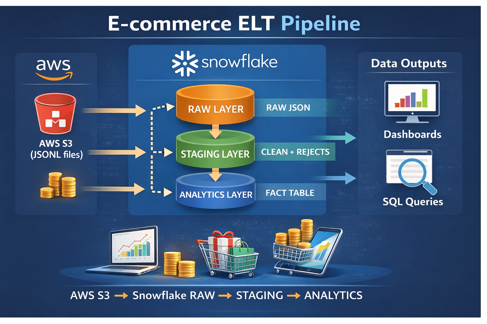
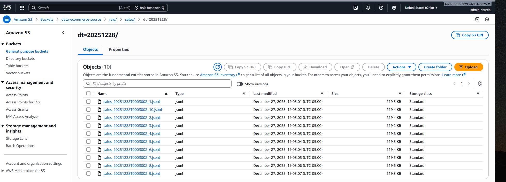
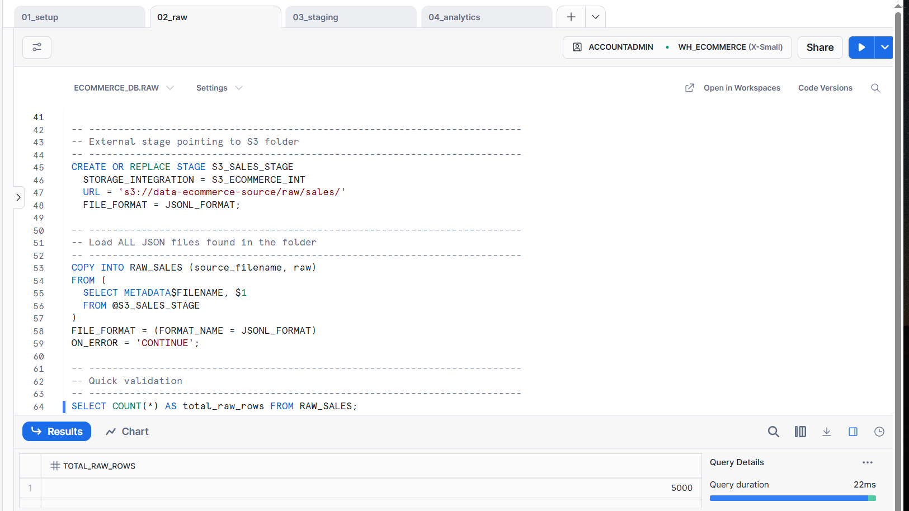
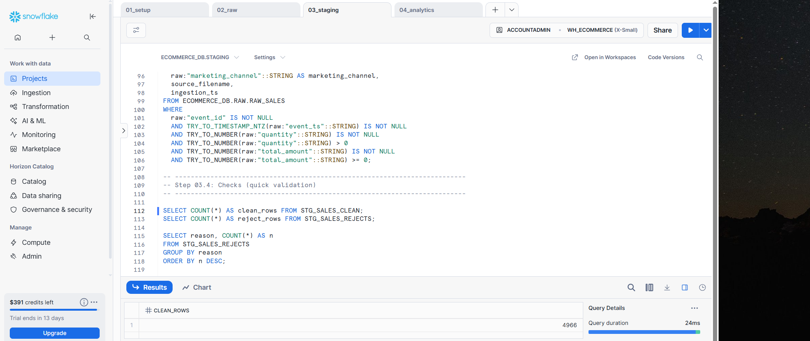
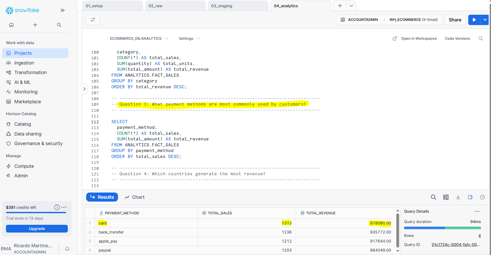

# E-commerce Data Pipeline | AWS S3 → Snowflake

This project demonstrates a **simple and professional end-to-end data pipeline** for e-commerce events using **AWS S3** and **Snowflake**.

The pipeline follows a classic **RAW → STAGING → ANALYTICS** architecture and focuses on:
- loading semi-structured **JSON** data,
- applying data quality rules,
- separating clean vs rejected records,
- and enabling basic business analytics.

---

## Project Architecture

- **Python** generates JSONL e-commerce events
- Files are uploaded to **AWS S3** 
- **Snowflake RAW** stores original JSON
- **Snowflake STAGING** separates clean and rejected records
- **Snowflake ANALYTICS** provides an analytics-ready fact table

---

## Architecture Overview

---

## Tech Stack

- **Python** (Faker, boto3)
- **AWS S3**
- **Snowflake**
- **SQL**
- **JSON Lines (JSONL)**

---

## Data Flow Explanation

### 1. Data Generation (Python)
A Python script generates synthetic e-commerce sales events in **JSONL format**, simulating:
- valid events
- invalid events (missing fields, wrong values)

These files are uploaded to **AWS S3**.

---

### 2. RAW Layer (Snowflake)
- All JSON records are loaded into `RAW.RAW_SALES`
- Raw data is stored
- No transformations are applied
- This layer keeps the full historical raw data

---

### 3. STAGING Layer (Data Quality)
Data is split into two tables:

#### `STG_SALES_CLEAN`
Contains **validated and cleaned records** ready for analytics.

#### `STG_SALES_REJECTS`
Contains records that failed data quality checks, along with:
- rejection reason
- raw JSON payload
- source filename
- ingestion timestamp

**Validation rules include:**
- Missing `event_id`
- Invalid `event_ts`
- Non-numeric or non-positive `quantity`
- Invalid or negative `total_amount`

---

### 4. ANALYTICS Layer
A single fact table is created:

#### `ANALYTICS.FACT_SALES`
- Built only from clean staging data
- Optimized for analytical queries
- Used to answer business questions

---

## Example Analytics Questions

- How much revenue do we generate per day?
- Which countries generate the most revenue?
- Which product categories perform best?
- Which marketing channels drive the most sales?
- What payment methods are most commonly used?

---

## Pipeline Walkthrough (Evidence)

### Raw Data Stored in Amazon S3

### RAW Layer — JSON Data in Snowflake

### STAGING Layer — Clean vs Rejected Records

### ANALYTICS Layer — Business Queries

---

## How to Run the Project

### Step 1 — Generate data and upload to S3

python scripts/generate_sales_to_s3.py

### Step 2 — Snowflake Setup

Run the SQL scripts **in the following order**:

1. `01_setup.sql`  
2. `02_raw.sql`  
3. `03_staging.sql`  
4. `04_analytics.sql`

Each script represents a logical layer of the data pipeline, from infrastructure setup to analytics-ready data.

---

### Why This Project Matters

This project demonstrates:

- A clear understanding of **modern data warehouse layering** (RAW → STAGING → ANALYTICS)
- The ability to handle **semi-structured JSON data** using Snowflake
- Implementation of **data quality validation rules**
- Proper separation of **clean vs rejected records** for auditability
- Transformation of raw data into **business-ready analytics tables**

---

## Author

**Ricardo Alfonso**  
Data Engineer | AWS | ELT | Snowflake

